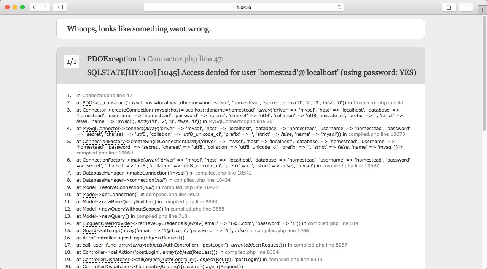

#安装

##1. 安装laravel,需要先安装composer，以下为安装方法

使用 curl 指令下载：
curl -sS https://getcomposer.org/installer | php

或是沒有安裝 curl ，也可以用 php 指令下载：
php -r "readfile('https://getcomposer.org/installer');" | php

或是手动下载 composer.phar
当你下载了 composer.phar 后，可以将它放在目录中，但每次当你建立新目录时，你必須再复制一个副本到新目录中，这样比较麻烦。所以最佳做法是将它放到 usr/local/bin 目录中中，成为全域指令。

mv composer.phar /usr/local/bin/composer

##2.安装laravel

切换到你想要放置laravel网站的目录下，运行命令：
composer create-project laravel/laravel learnlaravel5 5.0.22

运行完以后，配置网站的域名，learnlaravel5/public 为网站跟目录，配置网站目录可自行学习，然后把 config/app.php 29行的localhost换成你配置的网站域名

然后访问网址 如下图就可以了

查看路由文件 `learnlaravel5/app/Http/routes.php` 的代码：

Route::get('/', 'WelcomeController@index');

Route::get('home', 'HomeController@index');

Route::controllers([
	'auth' => 'Auth\AuthController',
	'password' => 'Auth\PasswordController',
]);
跟随代码里的蛛丝马迹，让我们访问 http://fuck.io:88/home （请自行替换域名），结果竟然跳转到了登陆页？

Laravel 自带了开箱即用的 Auth 系统，连页面都已经写好了。

让我们随意输入邮箱和密码，点击登录, 页面空白

执行 shell 命令：

cd learnlaravel5

sudo chmod -R 777 storage

重新访问 http://fuck.io:88/home ，随意输入邮箱和密码，如果你得到以下画面

那么恭喜你~ Laravel 5 安装成功！

# 数据库建立及迁移
Laravel 5 把数据库配置的地方改到了 `learnlaravel5/.env`，打开这个文件，编辑下面四项，修改为正确的信息：

DB_HOST=localhost

DB_DATABASE=laravel5

DB_USERNAME=root

DB_PASSWORD=password
推荐新建一个名为 laravel5 的数据库，为了学习方便，推荐使用 root 账户直接操作。

Laravel 已经为我们准备好了 Auth 部分的 migration，运行以下命令执行数据库迁移操作：

php artisan migrate

如果你运行命令报错，请检查数据库连接设置。

至此，数据库迁移已完成，你可以打开 http://fuck.io:88/home 欢快地尝试注册、登录啦。

